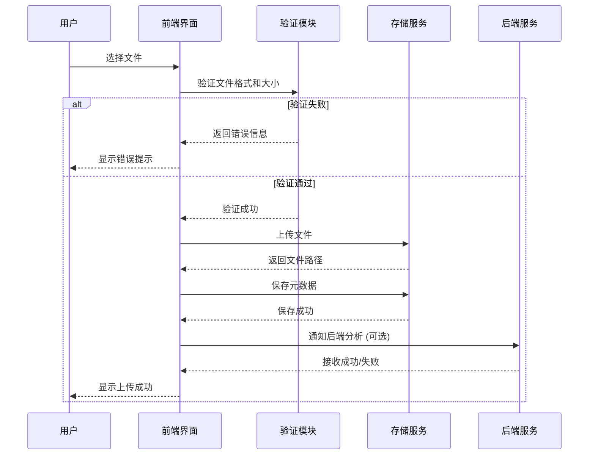
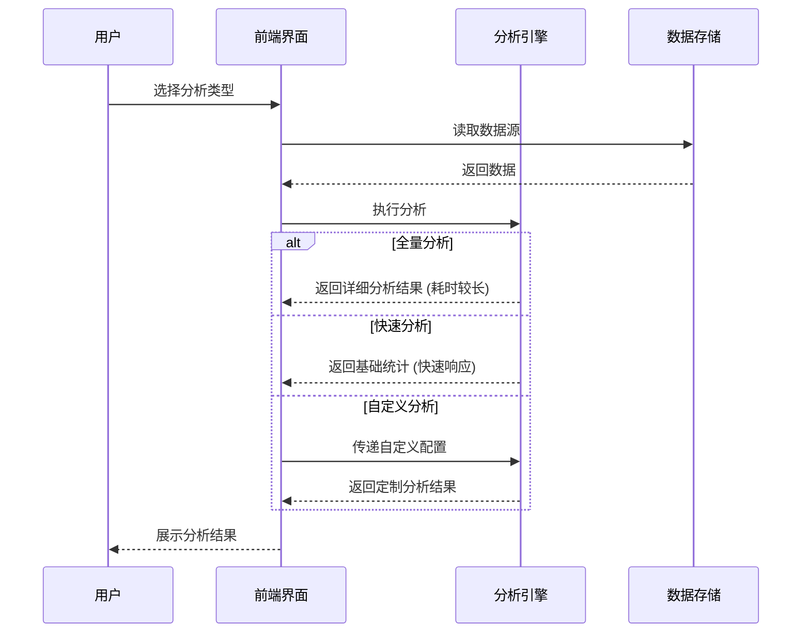
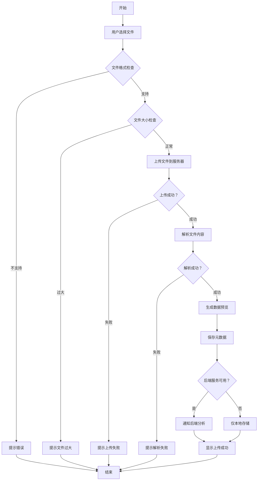
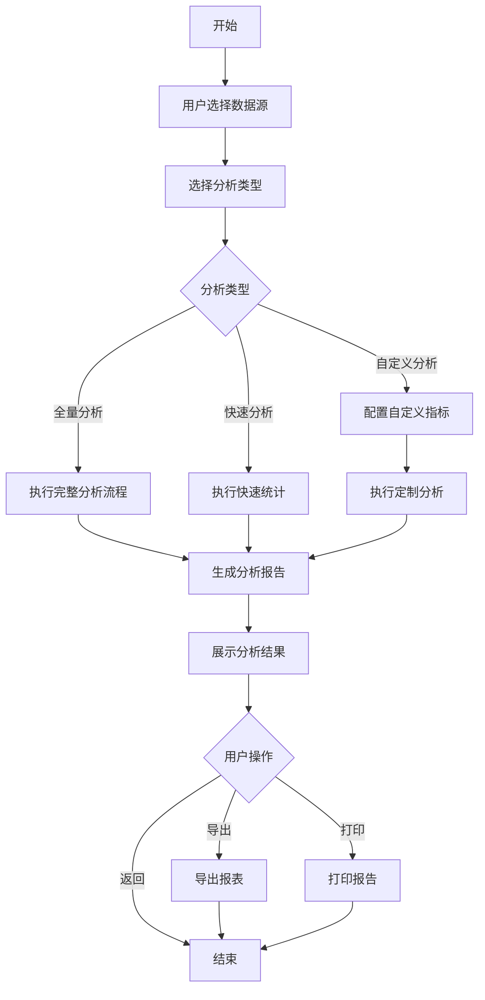
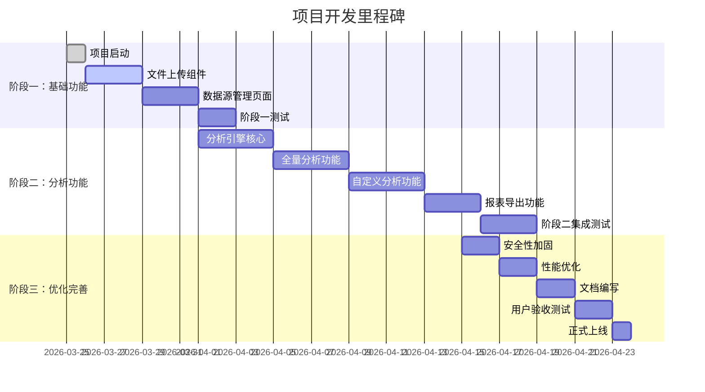
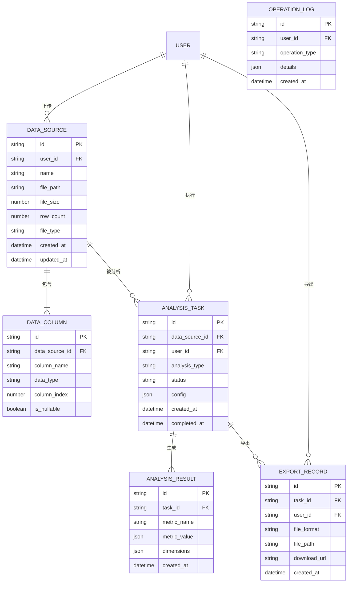
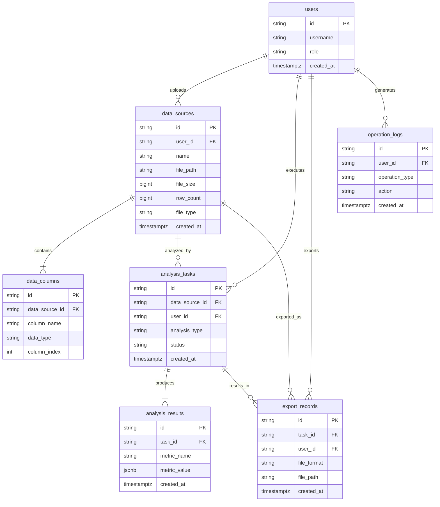

# 数据来源菜单 - 数据上传与数据分析功能需求文档

## 文档信息

| 项目 | 内容 |
|------|------|
| 文档版本 | v1.0 |
| 创建日期 | 2026-03-25 |
| 项目名称 | CXCC 呼叫中心数据分析系统 |
| 文档类型 | 需求规格说明书 |

---

## 目录

1. [功能概述](#1-功能概述)
2. [用户角色与权限](#2-用户角色与权限)
3. [详细功能需求](#3-详细功能需求)
4. [界面交互设计](#4-界面交互设计)
5. [业务流程](#5-业务流程)
6. [非功能需求](#6-非功能需求)
7. [实现路径](#7-实现路径)
8. [数据库设计](#8-数据库设计)
9. [附录](#9-附录)

---

## 1. 功能概述

### 1.1 项目背景

CXCC 呼叫中心数据分析系统的数据来源模块提供数据上传和数据分析功能，支持用户将外部数据源（Excel、CSV、JSON 等格式）上传至系统，并通过内置的分析引擎进行多维度数据分析，为业务决策提供数据支持。

### 1.2 功能定位

- **数据上传**：支持多种格式的数据文件上传，自动解析并存储到本地或数据库
- **数据分析**：提供全量分析、快速分析、自定义分析等多种分析模式
- **数据管理**：支持数据源列表查看、数据预览、数据删除等操作
- **报表导出**：支持分析结果导出为 Excel、CSV 等格式

### 1.3 核心价值

1. **降低数据接入门槛**：无需编程，通过界面操作即可完成数据上传
2. **提升分析效率**：内置分析模型，一键生成分析报告
3. **数据可视化**：图表展示分析结果，直观易懂
4. **灵活扩展**：支持自定义指标和维度分析

### 1.4 功能范围

| 功能模块 | 功能点 | 优先级 |
|---------|--------|--------|
| 数据上传 | 文件选择、格式验证、数据预览、上传确认 | P0 |
| 数据源管理 | 数据源列表、数据预览、数据删除 | P0 |
| 数据分析 | 全量分析、快速分析、自定义分析 | P0 |
| 报表导出 | Excel 导出、CSV 导出 | P1 |
| 数据同步 | 与后端服务数据同步 | P1 |

---

## 2. 用户角色与权限

### 2.1 用户角色定义

| 角色 | 描述 | 典型用户 |
|------|------|----------|
| 系统管理员 | 拥有系统全部权限，可管理所有数据源和分析功能 | IT 运维人员 |
| 数据分析师 | 可上传数据、执行分析、导出报表 | 业务分析人员 |
| 普通用户 | 仅可查看已上传的数据和分析结果 | 业务人员 |
| 访客 | 仅可查看公开的分析报告 | 外部人员 |

### 2.2 权限矩阵

| 功能/角色 | 系统管理员 | 数据分析师 | 普通用户 | 访客 |
|----------|-----------|-----------|---------|------|
| 上传数据 | ✅ | ✅ | ❌ | ❌ |
| 查看数据源列表 | ✅ | ✅ | ✅ | ❌ |
| 预览数据 | ✅ | ✅ | ✅ | ❌ |
| 删除数据源 | ✅ | ❌ | ❌ | ❌ |
| 执行全量分析 | ✅ | ✅ | ❌ | ❌ |
| 执行快速分析 | ✅ | ✅ | ✅ | ❌ |
| 执行自定义分析 | ✅ | ✅ | ❌ | ❌ |
| 导出报表 | ✅ | ✅ | ✅ | ❌ |
| 查看分析报告 | ✅ | ✅ | ✅ | ✅ |

### 2.3 权限控制实现

```typescript
// 权限检查示例代码
export const DATA_UPLOAD_PERMISSIONS = {
  upload: ['admin', 'analyst'],
  view: ['admin', 'analyst', 'user'],
  delete: ['admin'],
  analyze: ['admin', 'analyst'],
  export: ['admin', 'analyst', 'user'],
}

export function checkPermission(user: User, action: string): boolean {
  const allowedRoles = DATA_UPLOAD_PERMISSIONS[action]
  return allowedRoles?.includes(user.role) ?? false
}
```

---

## 3. 详细功能需求

### 3.1 数据上传功能

#### 3.1.1 功能描述

用户通过界面选择本地文件，上传至系统并存储到指定位置，支持多种文件格式。

#### 3.1.2 输入要求

| 字段 | 类型 | 必填 | 说明 |
|------|------|------|------|
| 文件 | File | 是 | Excel(.xlsx/.xls)、CSV、JSON 格式 |
| 数据名称 | String | 是 | 数据源名称，2-50 个字符 |
| 数据描述 | String | 否 | 数据源描述，最多 200 个字符 |
| 数据分类 | String | 否 | 数据源分类标签 |

#### 3.1.3 处理逻辑

1. **文件验证**
   - 检查文件格式是否支持
   - 检查文件大小（最大 50MB）
   - 检查文件名长度（最大 100 字符）

2. **数据解析**
   - Excel 文件：读取所有 sheet，合并数据
   - CSV 文件：自动检测编码（UTF-8/GBK）
   - JSON 文件：验证 JSON 格式，支持数组或对象

3. **数据存储**
   - 本地存储：保存至 `uploads/` 目录
   - 数据库存储：记录元数据到 `data_sources` 表
   - 生成数据预览（前 5 行）

4. **后端服务通知**（可选）
   - 如果后端服务可用，通知后端进行深度分析
   - 如果后端服务不可用，仅做本地存储

#### 3.1.4 输出结果

```typescript
interface UploadResult {
  success: boolean
  message: string
  data: {
    filename: string
    filepath: string
    data_name: string
    preview: {
      columns: string[]
      row_count: number
      sample_data: Record<string, any>[]
      data_types: Record<string, string>
    }
  }
}
```

#### 3.1.5 异常处理

| 异常类型 | 错误码 | 处理方式 |
|---------|--------|---------|
| 文件格式不支持 | UPLOAD_001 | 提示支持的文件格式 |
| 文件过大 | UPLOAD_002 | 提示文件大小限制 |
| 文件名过长 | UPLOAD_003 | 提示缩短文件名 |
| 数据解析失败 | UPLOAD_004 | 提示检查文件格式 |
| 存储空间不足 | UPLOAD_005 | 联系管理员清理空间 |
| 后端服务不可用 | UPLOAD_006 | 提示仅本地存储，功能受限 |

### 3.2 数据源管理功能

#### 3.2.1 数据源列表

**功能描述**：展示所有已上传的数据源列表

**列表字段**：
- 数据源 ID
- 数据源名称
- 文件名
- 文件大小
- 上传时间
- 数据行数
- 操作按钮（预览、分析、删除）

**排序规则**：
- 默认按上传时间倒序
- 支持按名称、大小、时间排序

**筛选条件**：
- 数据源名称模糊搜索
- 文件格式筛选
- 上传时间范围

#### 3.2.2 数据预览

**功能描述**：展示数据源的前 100 行数据

**预览内容**：
- 表格形式展示数据
- 显示列名和数据类型
- 支持列宽调整
- 支持数据排序和筛选

#### 3.2.3 数据删除

**功能描述**：删除指定的数据源

**删除确认**：
- 弹出确认对话框
- 提示删除后不可恢复
- 确认后方可删除

**删除操作**：
- 删除本地文件
- 删除数据库记录
- 清理相关分析结果

### 3.3 数据分析功能

#### 3.3.1 全量分析

**功能描述**：对数据源进行全面的统计分析

**分析内容**：

1. **数据概览**
   - 总行数、总列数
   - 缺失值统计
   - 重复值统计
   - 数据类型分布

2. **数值型字段分析**
   - 平均值、中位数、众数
   - 最大值、最小值
   - 标准差、方差
   - 四分位数
   - 分布直方图

3. **分类型字段分析**
   - 唯一值数量
   - 频率分布
   - 占比饼图
   - 柱状图

4. **时间型字段分析**
   - 时间跨度
   - 趋势分析
   - 周期性分析

5. **相关性分析**
   - 字段间相关系数
   - 热力图展示
   - 散点图矩阵

**输出结果**：
```typescript
interface FullAnalysisResult {
  overview: {
    total_rows: number
    total_columns: number
    missing_values: number
    duplicate_rows: number
  }
  numeric_analysis: {
    column_name: string
    mean: number
    median: number
    std_dev: number
    min: number
    max: number
    quartiles: { q1: number; q2: number; q3: number }
    histogram: { bins: number[]; counts: number[] }
  }[]
  categorical_analysis: {
    column_name: string
    unique_count: number
    frequency_distribution: { value: string; count: number }[]
  }[]
  correlation_matrix: number[][]
}
```

#### 3.3.2 快速分析

**功能描述**：快速生成数据的基本统计信息

**分析内容**：
- 数据行数、列数
- 每列的缺失值数量
- 数值列的基本统计（均值、最大、最小）
- 分类列的唯一值数量

**响应时间**：< 3 秒

#### 3.3.3 自定义分析

**功能描述**：用户自定义指标和维度进行分析

**自定义指标**：
- 求和（SUM）
- 平均值（AVG）
- 计数（COUNT）
- 最大值（MAX）
- 最小值（MIN）
- 中位数（MEDIAN）
- 标准差（STDDEV）

**自定义维度**：
- 日期维度（年、季度、月、日）
- 分类维度（按字段分组）
- 数值区间维度（分段统计）

**筛选条件**：
- 等于、不等于
- 大于、小于、介于
- 包含、不包含
- 开始于、结束于

**输出结果**：
```typescript
interface CustomAnalysisResult {
  metrics: string[]
  dimensions: string[]
  data: {
    [dimension: string]: string | number
    [metric: string]: number
  }[]
  summary: {
    total_groups: number
    total_records: number
  }
}
```

### 3.4 报表导出功能

#### 3.4.1 Excel 导出

**导出内容**：
- 分析结果表格
- 图表（嵌入到 Excel）
- 数据透视表

**导出格式**：
- `.xlsx` 格式
- 支持多 sheet
- 自动调整列宽
- 添加表头和样式

#### 3.4.2 CSV 导出

**导出内容**：
- 纯数据表格
- UTF-8 编码
- 包含表头

#### 3.4.3 导出限制

| 限制项 | 值 | 说明 |
|--------|-----|------|
| 最大导出行数 | 100,000 | 超过需分批导出 |
| 最大文件大小 | 100MB | 超过提示压缩 |
| 并发导出任务 | 3 | 防止服务器过载 |

---

## 4. 界面交互设计

### 4.1 页面布局

#### 4.1.1 数据上传页面

```
┌─────────────────────────────────────────────────────────┐
│  数据来源 > 数据上传                                      │
├─────────────────────────────────────────────────────────┤
│                                                          │
│  ┌──────────────────────────────────────────────────┐   │
│  │                                                   │   │
│  │          📁 拖拽文件到此处或点击上传               │   │
│  │                                                   │   │
│  │          支持格式：Excel、CSV、JSON               │   │
│  │          最大文件大小：50MB                       │   │
│  │                                                   │   │
│  └──────────────────────────────────────────────────┘   │
│                                                          │
│  数据名称：[________________________]                    │
│  数据描述：[________________________]                    │
│  数据分类：[▼ 请选择分类    ]                           │
│                                                          │
│  [ 取消 ]                    [ 开始上传 ]                │
│                                                          │
└─────────────────────────────────────────────────────────┘
```

#### 4.1.2 数据源列表页面

```
┌─────────────────────────────────────────────────────────┐
│  数据来源 > 数据源管理                                    │
├─────────────────────────────────────────────────────────┤
│  搜索：[________________] [搜索]                        │
│  格式：[▼ 全部]  时间：[开始] - [结束]  [重置] [查询]   │
├─────────────────────────────────────────────────────────┤
│  [上传新数据]                                           │
├─────────────────────────────────────────────────────────┤
│  数据源名称    文件名      大小    行数   上传时间  操作│
│  ├──────────────────────────────────────────────────┤   │
│  │ 销售数据    sales.xlsx  2.3MB  1234  2026-03-25 │   │
│  │ 客户信息    customer.csv 1.1MB  5678  2026-03-24 │   │
│  │ 产品列表    products.json 0.5MB 234  2026-03-23 │   │
│  └──────────────────────────────────────────────────┘   │
│                                                          │
│  共 3 条记录                              [1] [2] [3]   │
└─────────────────────────────────────────────────────────┘
```

#### 4.1.3 数据分析页面

```
┌─────────────────────────────────────────────────────────┐
│  数据来源 > 数据分析 > 销售数据                           │
├─────────────────────────────────────────────────────────┤
│  分析类型：● 全量分析  ○ 快速分析  ○ 自定义分析         │
├─────────────────────────────────────────────────────────┤
│  ┌─────────────┐ ┌─────────────┐ ┌─────────────┐       │
│  │  总行数     │ │  总列数     │ │  缺失值     │       │
│  │  12,345     │ │    23       │ │    156      │       │
│  └─────────────┘ └─────────────┘ └─────────────┘       │
├─────────────────────────────────────────────────────────┤
│  ┌─────────────────────────────────────────────────┐    │
│  │                                                 │    │
│  │            分析结果图表展示区                    │    │
│  │                                                 │    │
│  └─────────────────────────────────────────────────┘    │
│                                                          │
│  [导出 Excel] [导出 CSV] [打印报告]                      │
└─────────────────────────────────────────────────────────┘
```

### 4.2 交互流程

#### 4.2.1 数据上传流程



#### 4.2.2 数据分析流程



### 4.3 组件设计

#### 4.3.1 文件上传组件

```typescript
interface FileUploadProps {
  acceptFormats: string[]
  maxSize: number
  onFileSelect: (file: File) => void
  onUploadProgress: (progress: number) => void
  onUploadComplete: (result: UploadResult) => void
  onUploadError: (error: Error) => void
}
```

#### 4.3.2 数据预览组件

```typescript
interface DataPreviewProps {
  data: Record<string, any>[]
  columns: ColumnDefinition[]
  pageSize: number
  sortable: boolean
  filterable: boolean
  onRowClick?: (row: Record<string, any>) => void
}
```

#### 4.3.3 图表展示组件

```typescript
interface ChartDisplayProps {
  chartType: 'bar' | 'line' | 'pie' | 'scatter' | 'histogram'
  data: ChartData
  title: string
  xAxis?: string
  yAxis?: string
  legend?: string[]
  exportable: boolean
}
```

---

## 5. 业务流程

### 5.1 数据上传业务流程



### 5.2 数据分析业务流程



### 5.3 数据流转流程


---

## 6. 非功能需求

### 6.1 性能需求

| 指标 | 要求 | 说明 |
|------|------|------|
| 文件上传响应时间 | < 2 秒 | 50MB 以内文件 |
| 快速分析响应时间 | < 3 秒 | 10 万行以内数据 |
| 全量分析响应时间 | < 30 秒 | 10 万行以内数据 |
| 页面加载时间 | < 2 秒 | 首屏加载 |
| 并发用户数 | ≥ 50 | 同时在线用户 |
| 系统可用性 | ≥ 99% | 月度可用性 |

### 6.2 安全性需求

#### 6.2.1 文件安全

1. **文件类型验证**
   - 检查文件扩展名
   - 检查文件 MIME 类型
   - 检查文件内容签名

2. **文件内容扫描**
   - 病毒扫描
   - 恶意代码检测
   - SQL 注入检测

3. **文件存储安全**
   - 隔离存储用户上传文件
   - 禁止执行上传目录中的脚本
   - 限制文件访问权限

#### 6.2.2 数据安全

1. **数据加密**
   - 传输加密（HTTPS）
   - 存储加密（可选）
   - 敏感数据脱敏

2. **访问控制**
   - 用户身份验证
   - 权限校验
   - 操作审计日志

3. **数据备份**
   - 定期备份上传文件
   - 备份恢复机制
   - 灾难恢复预案

#### 6.2.3 接口安全

```typescript
// 接口安全中间件示例
export async function validateRequest(req: Request): Promise<boolean> {
  // 1. 验证 Token
  const token = req.headers.get('Authorization')
  if (!token || !isValidToken(token)) return false
  
  // 2. 验证请求频率
  const clientId = getClientId(req)
  if (isRateLimitExceeded(clientId)) return false
  
  // 3. 验证请求内容
  const body = await req.json()
  if (containsMaliciousContent(body)) return false
  
  return true
}
```

### 6.3 兼容性需求

#### 6.3.1 浏览器兼容

| 浏览器 | 最低版本 | 说明 |
|--------|---------|------|
| Chrome | 90+ | 推荐使用 |
| Firefox | 88+ | 完全支持 |
| Safari | 14+ | 完全支持 |
| Edge | 90+ | 完全支持 |
| IE | 不支持 | 已停止支持 |

#### 6.3.2 文件格式兼容

| 格式 | 扩展名 | 支持版本 |
|------|--------|---------|
| Excel | .xlsx | Office 2007+ |
| Excel | .xls | Office 97-2003 |
| CSV | .csv | UTF-8/GBK 编码 |
| JSON | .json | UTF-8 编码 |

#### 6.3.3 操作系统兼容

- Windows 10/11
- macOS 10.15+
- Linux (Ubuntu 18.04+)

### 6.4 可扩展性需求

1. **模块化设计**
   - 插件式架构
   - 支持自定义分析模块
   - 支持自定义导出格式

2. **水平扩展**
   - 支持多实例部署
   - 负载均衡
   - 分布式存储

3. **API 开放**
   - RESTful API
   - WebSocket 实时推送
   - Webhook 事件通知

### 6.5 可维护性需求

1. **日志记录**
   - 操作日志
   - 错误日志
   - 性能日志

2. **监控告警**
   - 系统健康监控
   - 性能指标监控
   - 异常告警通知

3. **文档完善**
   - API 文档
   - 用户手册
   - 运维手册

---

## 7. 实现路径

### 7.1 开发阶段划分

#### 阶段一：基础功能开发（2 周）

**时间**：第 1-2 周

**目标**：完成数据上传和数据源管理基础功能

**任务列表**：
- [ ] 搭建项目框架
- [ ] 实现文件上传组件
- [ ] 实现文件验证逻辑
- [ ] 实现本地文件存储
- [ ] 实现数据源列表页面
- [ ] 实现数据预览功能
- [ ] 实现数据删除功能
- [ ] 单元测试

**交付物**：
- 可运行的数据上传功能
- 数据源管理页面
- 单元测试报告

#### 阶段二：分析功能开发（3 周）

**时间**：第 3-5 周

**目标**：完成数据分析和报表导出功能

**任务列表**：
- [ ] 实现分析引擎核心逻辑
- [ ] 实现全量分析功能
- [ ] 实现快速分析功能
- [ ] 实现自定义分析功能
- [ ] 实现图表展示组件
- [ ] 实现报表导出功能
- [ ] 性能优化
- [ ] 集成测试

**交付物**：
- 完整的数据分析功能
- 报表导出功能
- 性能测试报告

#### 阶段三：优化与完善（1 周）

**时间**：第 6 周

**目标**：系统优化、安全加固、文档完善

**任务列表**：
- [ ] 安全性加固
- [ ] 性能调优
- [ ] 用户体验优化
- [ ] 编写用户文档
- [ ] 编写运维文档
- [ ] 用户验收测试
- [ ] Bug 修复

**交付物**：
- 生产就绪的系统
- 完整的文档
- 用户验收报告

### 7.2 技术栈选择

#### 前端技术栈

| 技术 | 选型 | 说明 |
|------|------|------|
| 框架 | Next.js 16+ | React 全栈框架 |
| 语言 | TypeScript 5+ | 类型安全 |
| UI 组件 | shadcn/ui | 现代化组件库 |
| 图表 | ECharts 6+ | 强大的图表库 |
| 表格 | TanStack Table | 高性能表格 |
| 状态管理 | React Query | 服务端状态管理 |
| 样式 | Tailwind CSS 4+ | 原子化 CSS |

#### 后端技术栈

| 技术 | 选型 | 说明 |
|------|------|------|
| 框架 | FastAPI | Python 高性能框架 |
| 语言 | Python 3.10+ | 数据分析生态 |
| 数据处理 | Pandas 2+ | 数据处理库 |
| 数值计算 | NumPy 1.24+ | 数值计算库 |
| 机器学习 | Scikit-learn 1.2+ | 机器学习库 |
| 文件处理 | openpyxl 3.1+ | Excel 处理 |

#### 数据库技术栈

| 技术 | 选型 | 说明 |
|------|------|------|
| 主数据库 | PostgreSQL 15+ | 关系型数据库 |
| 缓存 | Redis 7+ | 内存缓存 |
| 文件存储 | 本地文件系统 | 上传文件存储 |
| ORM | Drizzle ORM | TypeScript ORM |

####  DevOps 技术栈

| 技术 | 选型 | 说明 |
|------|------|------|
| 容器化 | Docker 24+ | 容器编排 |
| CI/CD | GitHub Actions | 持续集成 |
| 监控 | Prometheus + Grafana | 监控告警 |
| 日志 | Winston | 日志记录 |

### 7.3 关键技术难点及解决方案

#### 难点一：大文件上传性能优化

**问题描述**：上传大文件（>50MB）时，浏览器可能超时或内存溢出

**解决方案**：
1. **分片上传**
   ```typescript
   // 分片上传实现
   async function uploadFileInChunks(file: File, chunkSize: number = 5 * 1024 * 1024) {
     const chunks = Math.ceil(file.size / chunkSize)
     const uploadId = generateUploadId()
     
     for (let i = 0; i < chunks; i++) {
       const start = i * chunkSize
       const end = Math.min(file.size, (i + 1) * chunkSize)
       const chunk = file.slice(start, end)
       
       await uploadChunk(uploadId, chunk, i, chunks)
       updateProgress((i + 1) / chunks * 100)
     }
     
     return await finalizeUpload(uploadId)
   }
   ```

2. **断点续传**
   - 记录已上传的分片
   - 支持失败后从断点继续

3. **Web Worker 处理**
   - 使用 Web Worker 进行文件分片
   - 避免阻塞主线程

#### 难点二：大数据量分析性能

**问题描述**：分析大量数据（>100 万行）时，响应时间长

**解决方案**：
1. **抽样分析**
   ```python
   # 大数据集抽样分析
   def analyze_large_dataset(df: pd.DataFrame, max_rows: int = 100000):
       if len(df) > max_rows:
           sample_df = df.sample(n=max_rows, random_state=42)
           return perform_analysis(sample_df)
       return perform_analysis(df)
   ```

2. **增量计算**
   - 流式处理数据
   - 分批计算统计指标

3. **并行计算**
   ```python
   # 使用 multiprocessing 并行分析
   from multiprocessing import Pool
   
   def parallel_analysis(df, num_processes=4):
       chunks = np.array_split(df, num_processes)
       with Pool(num_processes) as p:
           results = p.map(chunk_analysis, chunks)
       return merge_results(results)
   ```

4. **缓存优化**
   - 缓存分析结果
   - 增量更新缓存

#### 难点三：文件编码自动检测

**问题描述**：CSV 文件编码多样，自动检测准确率低

**解决方案**：
```python
import chardet

def detect_file_encoding(file_path: str) -> str:
    # 读取文件前 10KB 进行检测
    with open(file_path, 'rb') as f:
        raw_data = f.read(10240)
        result = chardet.detect(raw_data)
        confidence = result['confidence']
        encoding = result['encoding']
        
        # 置信度低于 0.7 时，尝试多种编码
        if confidence < 0.7:
            encodings_to_try = ['utf-8', 'gbk', 'gb2312', 'gb18030']
            for enc in encodings_to_try:
                try:
                    raw_data.decode(enc)
                    return enc
                except:
                    continue
            return 'utf-8'  # 默认
        
        return encoding if encoding else 'utf-8'
```

#### 难点四：并发上传控制

**问题描述**：多用户同时上传大文件，服务器资源耗尽

**解决方案**：
1. **队列管理**
   ```typescript
   // 上传队列管理
   class UploadQueue {
     private queue: UploadTask[] = []
     private activeUploads = 0
     private maxConcurrent = 3
     
     async addTask(task: UploadTask) {
       this.queue.push(task)
       this.processQueue()
     }
     
     private async processQueue() {
       while (this.queue.length > 0 && this.activeUploads < this.maxConcurrent) {
         const task = this.queue.shift()
         this.activeUploads++
         
         try {
           await task.execute()
         } finally {
           this.activeUploads--
           this.processQueue()
         }
       }
     }
   }
   ```

2. **资源限制**
   - 限制单个用户上传频率
   - 限制总上传带宽

### 7.4 开发里程碑与时间节点



**关键里程碑**：

| 里程碑 | 日期 | 交付物 |
|--------|------|--------|
| M1: 项目启动 | 2026-03-25 | 项目计划、环境搭建 |
| M2: 上传功能完成 | 2026-03-28 | 文件上传功能可用 |
| M3: 数据管理完成 | 2026-03-31 | 数据源管理页面可用 |
| M4: 阶段一验收 | 2026-04-02 | 阶段一测试报告 |
| M5: 分析引擎完成 | 2026-04-05 | 分析引擎核心可用 |
| M6: 全量分析完成 | 2026-04-09 | 全量分析功能可用 |
| M7: 自定义分析完成 | 2026-04-13 | 自定义分析功能可用 |
| M8: 导出功能完成 | 2026-04-16 | 报表导出功能可用 |
| M9: 阶段二验收 | 2026-04-19 | 集成测试报告 |
| M10: 安全加固完成 | 2026-04-21 | 安全测试报告 |
| M11: 性能优化完成 | 2026-04-23 | 性能测试报告 |
| M12: 文档完成 | 2026-04-25 | 完整文档 |
| M13: UAT 验收 | 2026-04-27 | 用户验收报告 |
| M14: 正式上线 | 2026-04-28 | 生产环境部署 |

---

## 8. 数据库设计

### 8.1 数据实体

#### 8.1.1 核心实体

1. **数据源（DataSource）**
   - 描述：用户上传的数据文件
   - 属性：ID、名称、文件路径、大小、行数、上传时间等

2. **数据列（DataColumn）**
   - 描述：数据源中的列定义
   - 属性：ID、数据源 ID、列名、数据类型、索引等

3. **分析任务（AnalysisTask）**
   - 描述：数据分析任务记录
   - 属性：ID、数据源 ID、分析类型、状态、结果等

4. **分析结果（AnalysisResult）**
   - 描述：分析结果数据
   - 属性：ID、任务 ID、指标名称、指标值、维度等

5. **导出记录（ExportRecord）**
   - 描述：报表导出记录
   - 属性：ID、任务 ID、文件格式、文件路径、下载链接等

#### 8.1.2 辅助实体

1. **用户（User）**
   - 描述：系统用户
   - 属性：ID、用户名、角色、权限等

2. **操作日志（OperationLog）**
   - 描述：用户操作记录
   - 属性：ID、用户 ID、操作类型、操作时间、详情等

### 8.2 关系模型



### 8.3 表结构定义

#### 8.3.1 数据源表 (data_sources)

```sql
CREATE TABLE data_sources (
    id VARCHAR(36) PRIMARY KEY,
    user_id VARCHAR(36) NOT NULL,
    name VARCHAR(255) NOT NULL,
    description TEXT,
    category VARCHAR(100),
    file_path VARCHAR(512) NOT NULL,
    original_filename VARCHAR(255) NOT NULL,
    file_size BIGINT NOT NULL,
    file_type VARCHAR(20) NOT NULL,
    row_count BIGINT DEFAULT 0,
    column_count INT DEFAULT 0,
    status VARCHAR(20) DEFAULT 'active',
    metadata JSONB,
    created_at TIMESTAMP WITH TIME ZONE DEFAULT CURRENT_TIMESTAMP,
    updated_at TIMESTAMP WITH TIME ZONE DEFAULT CURRENT_TIMESTAMP,
    deleted_at TIMESTAMP WITH TIME ZONE,
    
    CONSTRAINT chk_file_size CHECK (file_size > 0 AND file_size <= 52428800),
    CONSTRAINT chk_file_type CHECK (file_type IN ('xlsx', 'xls', 'csv', 'json'))
);

-- 索引
CREATE INDEX idx_data_sources_user_id ON data_sources(user_id);
CREATE INDEX idx_data_sources_status ON data_sources(status);
CREATE INDEX idx_data_sources_created_at ON data_sources(created_at DESC);
CREATE INDEX idx_data_sources_name ON data_sources(name);
CREATE INDEX idx_data_sources_category ON data_sources(category);
CREATE INDEX idx_data_sources_deleted ON data_sources(deleted_at) WHERE deleted_at IS NOT NULL;
```

#### 8.3.2 数据列表 (data_columns)

```sql
CREATE TABLE data_columns (
    id VARCHAR(36) PRIMARY KEY,
    data_source_id VARCHAR(36) NOT NULL,
    column_name VARCHAR(255) NOT NULL,
    column_name_original VARCHAR(255),
    data_type VARCHAR(50) NOT NULL,
    column_index INT NOT NULL,
    is_nullable BOOLEAN DEFAULT true,
    is_unique BOOLEAN DEFAULT false,
    unique_count BIGINT,
    min_value NUMERIC,
    max_value NUMERIC,
    mean_value NUMERIC,
    null_count BIGINT DEFAULT 0,
    metadata JSONB,
    created_at TIMESTAMP WITH TIME ZONE DEFAULT CURRENT_TIMESTAMP,
    
    CONSTRAINT fk_data_columns_data_source 
        FOREIGN KEY (data_source_id) REFERENCES data_sources(id) ON DELETE CASCADE,
    CONSTRAINT chk_column_index CHECK (column_index >= 0),
    UNIQUE (data_source_id, column_name)
);

-- 索引
CREATE INDEX idx_data_columns_data_source_id ON data_columns(data_source_id);
CREATE INDEX idx_data_columns_data_type ON data_columns(data_type);
```

#### 8.3.3 分析任务表 (analysis_tasks)

```sql
CREATE TABLE analysis_tasks (
    id VARCHAR(36) PRIMARY KEY,
    data_source_id VARCHAR(36) NOT NULL,
    user_id VARCHAR(36) NOT NULL,
    analysis_type VARCHAR(50) NOT NULL,
    status VARCHAR(20) DEFAULT 'pending',
    progress NUMERIC(5,2) DEFAULT 0,
    config JSONB,
    error_message TEXT,
    result_summary JSONB,
    started_at TIMESTAMP WITH TIME ZONE,
    completed_at TIMESTAMP WITH TIME ZONE,
    created_at TIMESTAMP WITH TIME ZONE DEFAULT CURRENT_TIMESTAMP,
    
    CONSTRAINT fk_analysis_tasks_data_source 
        FOREIGN KEY (data_source_id) REFERENCES data_sources(id) ON DELETE CASCADE,
    CONSTRAINT fk_analysis_tasks_user 
        FOREIGN KEY (user_id) REFERENCES users(id) ON DELETE CASCADE,
    CONSTRAINT chk_analysis_type CHECK (analysis_type IN ('full', 'quick', 'custom')),
    CONSTRAINT chk_status CHECK (status IN ('pending', 'running', 'completed', 'failed', 'cancelled')),
    CONSTRAINT chk_progress CHECK (progress >= 0 AND progress <= 100)
);

-- 索引
CREATE INDEX idx_analysis_tasks_data_source_id ON analysis_tasks(data_source_id);
CREATE INDEX idx_analysis_tasks_user_id ON analysis_tasks(user_id);
CREATE INDEX idx_analysis_tasks_status ON analysis_tasks(status);
CREATE INDEX idx_analysis_tasks_created_at ON analysis_tasks(created_at DESC);
CREATE INDEX idx_analysis_tasks_type_status ON analysis_tasks(analysis_type, status);
```

#### 8.3.4 分析结果表 (analysis_results)

```sql
CREATE TABLE analysis_results (
    id VARCHAR(36) PRIMARY KEY,
    task_id VARCHAR(36) NOT NULL,
    metric_category VARCHAR(50),
    metric_name VARCHAR(255) NOT NULL,
    metric_value JSONB NOT NULL,
    dimensions JSONB,
    chart_data JSONB,
    sort_order INT DEFAULT 0,
    created_at TIMESTAMP WITH TIME ZONE DEFAULT CURRENT_TIMESTAMP,
    
    CONSTRAINT fk_analysis_results_task 
        FOREIGN KEY (task_id) REFERENCES analysis_tasks(id) ON DELETE CASCADE
);

-- 索引
CREATE INDEX idx_analysis_results_task_id ON analysis_results(task_id);
CREATE INDEX idx_analysis_results_category ON analysis_results(metric_category);
CREATE INDEX idx_analysis_results_name ON analysis_results(metric_name);
CREATE INDEX idx_analysis_results_sort ON analysis_results(sort_order);

-- 分区表（按任务 ID 分区，适用于大数据量场景）
CREATE TABLE analysis_results_partitioned (
    LIKE analysis_results INCLUDING ALL
) PARTITION BY HASH (task_id);
```

#### 8.3.5 导出记录表 (export_records)

```sql
CREATE TABLE export_records (
    id VARCHAR(36) PRIMARY KEY,
    task_id VARCHAR(36),
    user_id VARCHAR(36) NOT NULL,
    data_source_id VARCHAR(36),
    file_format VARCHAR(20) NOT NULL,
    file_path VARCHAR(512) NOT NULL,
    file_size BIGINT,
    download_url TEXT,
    download_count INT DEFAULT 0,
    expires_at TIMESTAMP WITH TIME ZONE,
    status VARCHAR(20) DEFAULT 'pending',
    error_message TEXT,
    created_at TIMESTAMP WITH TIME ZONE DEFAULT CURRENT_TIMESTAMP,
    downloaded_at TIMESTAMP WITH TIME ZONE,
    
    CONSTRAINT fk_export_records_task 
        FOREIGN KEY (task_id) REFERENCES analysis_tasks(id) ON DELETE SET NULL,
    CONSTRAINT fk_export_records_user 
        FOREIGN KEY (user_id) REFERENCES users(id) ON DELETE CASCADE,
    CONSTRAINT fk_export_records_data_source 
        FOREIGN KEY (data_source_id) REFERENCES data_sources(id) ON DELETE SET NULL,
    CONSTRAINT chk_file_format CHECK (file_format IN ('xlsx', 'csv', 'pdf', 'json')),
    CONSTRAINT chk_status CHECK (status IN ('pending', 'processing', 'completed', 'failed', 'expired'))
);

-- 索引
CREATE INDEX idx_export_records_user_id ON export_records(user_id);
CREATE INDEX idx_export_records_task_id ON export_records(task_id);
CREATE INDEX idx_export_records_status ON export_records(status);
CREATE INDEX idx_export_records_created_at ON export_records(created_at DESC);
CREATE INDEX idx_export_records_expires ON export_records(expires_at) WHERE expires_at IS NOT NULL;
```

#### 8.3.6 操作日志表 (operation_logs)

```sql
CREATE TABLE operation_logs (
    id VARCHAR(36) PRIMARY KEY,
    user_id VARCHAR(36),
    operation_type VARCHAR(50) NOT NULL,
    resource_type VARCHAR(50),
    resource_id VARCHAR(36),
    action VARCHAR(50) NOT NULL,
    details JSONB,
    ip_address INET,
    user_agent TEXT,
    status VARCHAR(20) DEFAULT 'success',
    error_message TEXT,
    execution_time_ms INT,
    created_at TIMESTAMP WITH TIME ZONE DEFAULT CURRENT_TIMESTAMP,
    
    CONSTRAINT fk_operation_logs_user 
        FOREIGN KEY (user_id) REFERENCES users(id) ON DELETE SET NULL,
    CONSTRAINT chk_status CHECK (status IN ('success', 'failure', 'error')),
    CONSTRAINT chk_execution_time CHECK (execution_time_ms >= 0)
);

-- 索引
CREATE INDEX idx_operation_logs_user_id ON operation_logs(user_id);
CREATE INDEX idx_operation_logs_type ON operation_logs(operation_type);
CREATE INDEX idx_operation_logs_resource ON operation_logs(resource_type, resource_id);
CREATE INDEX idx_operation_logs_created_at ON operation_logs(created_at DESC);
CREATE INDEX idx_operation_logs_status ON operation_logs(status);

-- 分区表（按月分区）
CREATE TABLE operation_logs_partitioned (
    LIKE operation_logs INCLUDING ALL
) PARTITION BY RANGE (created_at);
```

### 8.4 ER 图



### 8.5 数据字典

#### 8.5.1 数据类型枚举

```typescript
// 文件类型
enum FileType {
  XLSX = 'xlsx',
  XLS = 'xls',
  CSV = 'csv',
  JSON = 'json'
}

// 数据类型
enum ColumnDataType {
  STRING = 'string',
  NUMBER = 'number',
  INTEGER = 'integer',
  FLOAT = 'float',
  BOOLEAN = 'boolean',
  DATE = 'date',
  DATETIME = 'datetime',
  EMAIL = 'email',
  PHONE = 'phone',
  URL = 'url',
  UNKNOWN = 'unknown'
}

// 分析类型
enum AnalysisType {
  FULL = 'full',
  QUICK = 'quick',
  CUSTOM = 'custom'
}

// 任务状态
enum TaskStatus {
  PENDING = 'pending',
  RUNNING = 'running',
  COMPLETED = 'completed',
  FAILED = 'failed',
  CANCELLED = 'cancelled'
}

// 导出状态
enum ExportStatus {
  PENDING = 'pending',
  PROCESSING = 'processing',
  COMPLETED = 'completed',
  FAILED = 'failed',
  EXPIRED = 'expired'
}
```

#### 8.5.2 元数据结构

```typescript
// 数据源元数据
interface DataSourceMetadata {
  encoding?: string           // 文件编码
  delimiter?: string          // CSV 分隔符
  hasHeader?: boolean         // 是否有表头
  sheetNames?: string[]       // Excel sheet 名称
  parseTime?: number          // 解析耗时 (ms)
  validationErrors?: string[] // 验证错误
}

// 分析配置
interface AnalysisConfig {
  type: AnalysisType
  metrics?: string[]          // 自定义指标
  dimensions?: string[]       // 自定义维度
  filters?: FilterCondition[] // 筛选条件
  sampling?: {                // 抽样配置
    enabled: boolean
    sampleSize?: number
    sampleRate?: number
  }
}

// 筛选条件
interface FilterCondition {
  field: string
  operator: 'eq' | 'ne' | 'gt' | 'lt' | 'gte' | 'lte' | 'in' | 'like' | 'between'
  value: any
  value2?: any  // for between
}
```

---

## 9. 附录

### 9.1 API 接口文档

#### 9.1.1 数据上传接口

```typescript
// POST /api/data-sources/upload
interface UploadRequest {
  file: File
  data_name: string
  description?: string
  category?: string
}

interface UploadResponse {
  success: boolean
  message: string
  data: {
    filename: string
    filepath: string
    data_name: string
    preview: {
      columns: string[]
      row_count: number
      sample_data: Record<string, any>[]
      data_types: Record<string, string>
    }
  }
}
```

#### 9.1.2 数据分析接口

```typescript
// POST /api/data-sources/analyze
interface AnalyzeRequest {
  data_source_id: string
  analysis_type: 'full' | 'quick' | 'custom'
  custom_metrics?: string[]
  custom_dimensions?: string[]
  filters?: FilterCondition[]
}

interface AnalyzeResponse {
  success: boolean
  message: string
  data: {
    task_id: string
    status: string
    estimated_time?: number
  }
}

// GET /api/data-sources/analysis/:taskId
interface GetAnalysisResultResponse {
  success: boolean
  data: {
    task_id: string
    status: string
    progress: number
    result?: AnalysisResult
    error?: string
  }
}
```

#### 9.1.3 报表导出接口

```typescript
// POST /api/data-sources/export
interface ExportRequest {
  task_id: string
  format: 'xlsx' | 'csv' | 'pdf'
  options?: {
    includeCharts?: boolean
    includeSummary?: boolean
    sheetName?: string
  }
}

interface ExportResponse {
  success: boolean
  message: string
  data: {
    export_id: string
    download_url: string
    expires_at: string
  }
}
```

### 9.2 错误码定义

| 错误码 | 说明 | 解决方案 |
|--------|------|----------|
| UPLOAD_001 | 不支持的文件格式 | 上传支持的文件格式 |
| UPLOAD_002 | 文件过大 | 压缩文件或分批上传 |
| UPLOAD_003 | 文件名过长 | 缩短文件名 |
| UPLOAD_004 | 数据解析失败 | 检查文件格式 |
| UPLOAD_005 | 存储空间不足 | 联系管理员 |
| UPLOAD_006 | 后端服务不可用 | 仅本地存储 |
| ANALYZE_001 | 数据源不存在 | 检查数据源 ID |
| ANALYZE_002 | 分析任务失败 | 查看错误日志 |
| ANALYZE_003 | 分析超时 | 重试或联系管理员 |
| EXPORT_001 | 导出任务失败 | 重试导出 |
| EXPORT_002 | 导出文件已过期 | 重新导出 |
| PERMISSION_001 | 无权访问 | 联系管理员授权 |

### 9.3 性能优化建议

1. **数据库优化**
   - 使用连接池
   - 优化查询语句
   - 合理使用索引
   - 定期清理历史数据

2. **缓存策略**
   - 热点数据缓存
   - 分析结果缓存
   - 缓存过期策略

3. **文件存储优化**
   - 使用 CDN 加速
   - 文件压缩存储
   - 分布式存储

4. **前端优化**
   - 懒加载组件
   - 虚拟滚动表格
   - 图表数据抽样

### 9.4 测试用例

#### 9.4.1 单元测试

```typescript
describe('FileUpload', () => {
  test('should accept valid Excel file', () => {
    const file = new File(['test'], 'test.xlsx', { type: 'application/vnd.openxmlformats-officedocument.spreadsheetml.sheet' })
    expect(validateFile(file)).toBe(true)
  })
  
  test('should reject file larger than 50MB', () => {
    const file = new File([new ArrayBuffer(52428801)], 'test.xlsx')
    expect(validateFile(file)).toBe(false)
  })
})

describe('DataAnalysis', () => {
  test('should calculate mean correctly', () => {
    const data = [1, 2, 3, 4, 5]
    expect(calculateMean(data)).toBe(3)
  })
})
```

#### 9.4.2 集成测试

```typescript
describe('Upload and Analyze Flow', () => {
  test('should upload file and analyze successfully', async () => {
    const uploadResult = await uploadFile(testFile)
    expect(uploadResult.success).toBe(true)
    
    const analyzeResult = await analyzeData(uploadResult.data.data_source_id)
    expect(analyzeResult.success).toBe(true)
  })
})
```

### 9.5 部署指南

#### 9.5.1 环境要求

- Node.js 18+
- Python 3.10+
- PostgreSQL 15+
- Redis 7+
- 8GB+ RAM
- 100GB+ 磁盘空间

#### 9.5.2 部署步骤

1. **准备环境**
   ```bash
   # 安装依赖
   pnpm install
   pip install -r python-backend/requirements.txt
   ```

2. **配置数据库**
   ```bash
   # 创建数据库
   createdb cxcc_data_analysis
   
   # 运行迁移
   pnpm db:migrate
   ```

3. **配置环境变量**
   ```bash
   cp .env.example .env
   # 编辑 .env 文件配置