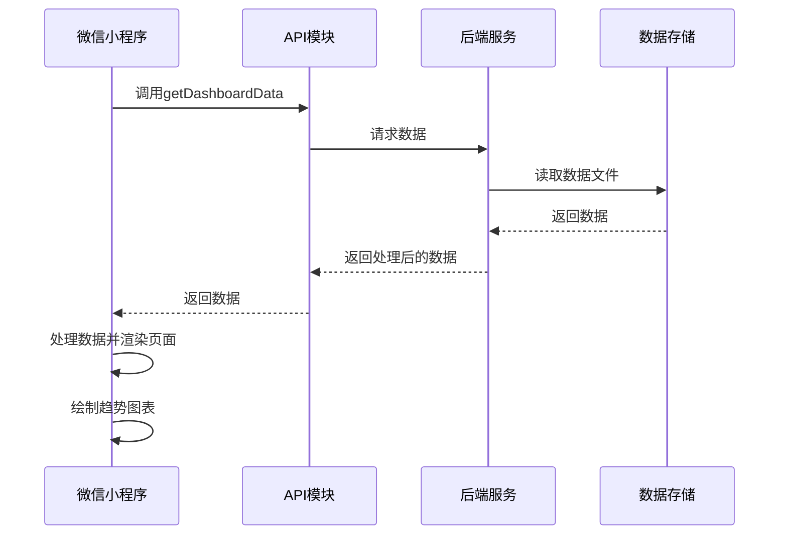

# 微信小程序系统设计文档

## 1. 系统设计概要

### 1.1 项目概述
本微信小程序是一个数据看板应用，用于展示呼叫中心的业务数据，包括数据概览、项目数据明细、趋势分析和团队数据。用户可以通过小程序实时查看业务数据，了解团队和项目的运营情况。

### 1.2 技术栈
- **前端框架**：微信小程序原生框架
- **后端服务**：Python FastAPI
- **数据存储**：JSON文件
- **图表绘制**：Canvas API
- **网络请求**：wx.request

### 1.3 系统架构


### 1.4 目录结构
```
wechat-miniprogram/
├── api/
│   └── api.js          # API请求模块
├── pages/
│   ├── dashboard/      # 数据看板页面
│   │   ├── dashboard.js
│   │   ├── dashboard.wxml
│   │   └── dashboard.wxss
│   └── team/           # 团队看板页面
│       ├── team.js
│       ├── team.wxml
│       └── team.wxss
├── utils/
│   └── util.js         # 工具函数
├── app.js              # 小程序入口文件
├── app.json            # 小程序配置文件
└── app.wxss            # 全局样式文件
```

## 2. 功能说明

### 2.1 数据看板页面

#### 2.1.1 核心功能
- **数据概览**：显示总呼叫量、接通量、成功量、坐席人数等关键指标
- **项目数据明细**：显示各个项目的详细数据，包括接通量、成功量、成功率、坐席人数、人均成功量等
- **团队数据**：显示各个团队的详细数据，作为项目数据的子项
- **趋势分析**：显示过去7天、15天或30天的成功量趋势图表
- **日期选择**：支持选择不同日期的数据
- **时间范围选择**：支持选择7天、15天或30天的时间范围查看趋势数据
- **自动刷新**：每30秒自动刷新数据，保持数据实时性

#### 2.1.2 页面结构
- 日期选择器：位于页面顶部，用于选择查询日期
- 数据概览卡片：显示核心指标，使用渐变色背景
- 项目数据明细表格：显示项目和团队数据，支持滚动
- 趋势分析图表：使用Canvas绘制的柱状图，显示成功量趋势
- 加载状态：显示数据加载中提示
- 错误提示：显示数据加载失败提示

### 2.2 团队看板页面

#### 2.2.1 核心功能
- **团队数据列表**：显示各个团队的详细数据，包括排名、团队名称、坐席人数、累计成交量、成交目标、人均成交量、完成率、优秀坐席等
- **日期选择**：支持选择不同日期的数据
- **自动刷新**：每30秒自动刷新数据，保持数据实时性
- **下拉刷新**：支持下拉刷新数据

#### 2.2.2 页面结构
- 日期选择器：位于页面顶部，用于选择查询日期
- 团队数据表格：显示团队详细数据，支持滚动
- 加载状态：显示数据加载中提示
- 错误提示：显示数据加载失败提示

### 2.3 全局功能

#### 2.3.1 日期同步
- 两个页面共享同一个日期选择，确保数据一致性
- 当在一个页面修改日期时，另一个页面会自动更新日期并重新加载数据

#### 2.3.2 自动刷新
- 两个页面都支持每30秒自动刷新数据
- 页面隐藏或卸载时会停止自动刷新，页面显示时会重新启动自动刷新

## 3. 业务逻辑

### 3.1 数据加载流程

#### 3.1.1 数据看板页面
1. 页面加载时初始化日期为当天
2. 从全局变量获取当前选择的日期
3. 调用API获取指定日期的数据
4. 处理返回的数据，计算合计数据
5. 更新页面数据，显示数据概览和项目数据明细
6. 调用loadTrendData方法获取趋势数据
7. 处理趋势数据并绘制图表
8. 启动自动刷新定时器

#### 3.1.2 团队看板页面
1. 页面加载时初始化日期为当天
2. 从全局变量获取当前选择的日期
3. 调用API获取指定日期的数据
4. 从返回的数据中提取团队数据
5. 更新页面数据，显示团队数据列表
6. 启动自动刷新定时器

### 3.2 日期选择流程
1. 用户点击日期选择器，选择新的日期
2. 更新页面的date数据
3. 更新全局变量中的selectedDate
4. 重新调用loadData方法加载新日期的数据

### 3.3 趋势数据加载流程
1. 根据选择的时间范围（7天、15天或30天）计算开始日期
2. 调用API获取开始日期到结束日期的数据
3. 处理返回的趋势数据，转换日期格式
4. 更新页面的trendData数据
5. 调用drawTrendChart方法绘制趋势图表

### 3.4 图表绘制流程
1. 获取Canvas元素的实际宽度
2. 计算数据范围，确定Y轴的最大值
3. 绘制网格线和数值标签
4. 绘制柱状图表示成功量
5. 绘制数据标签和日期标签
6. 绘制图表标题
7. 调用ctx.draw()方法渲染图表

## 4. API接口设计

### 4.1 接口列表

| 接口名称 | URL | 方法 | 功能描述 |
|---------|-----|------|----------|
| 获取数据看板数据 | /api/dashboard/statistics | GET | 获取指定日期范围的数据看板数据 |
| 获取团队数据 | /api/dashboard/statistics | GET | 获取指定日期范围的团队数据 |

### 4.2 请求参数

| 参数名称 | 类型 | 必填 | 描述 |
|---------|------|------|------|
| startDate | string | 是 | 开始日期，格式：YYYY-MM-DD |
| endDate | string | 是 | 结束日期，格式：YYYY-MM-DD |

### 4.3 响应格式

```json
{
  "code": 200,
  "message": "success",
  "data": {
    "overview": {
      "totalCalls": 16433,
      "connectedCalls": 3594,
      "successCalls": 36,
      "qualityRate": 55,
      "totalAgents": 12
    },
    "cityDetails": [
      {
        "cityCode": "茂名",
        "cityName": "茂名",
        "totalCalls": 0,
        "connectedCalls": 3594,
        "successCalls": 36,
        "successRate": 1,
        "avgDailySuccess": 36,
        "agentCount": 12,
        "avgSuccessPerAgent": 3,
        "teams": [
          {
            "teamId": "6",
            "teamName": "广东升档-如皓",
            "totalCalls": 917,
            "connectedCalls": 917,
            "successCalls": 17,
            "successRate": 1.9,
            "avgDailySuccess": 17,
            "agentCount": 3,
            "avgSuccessPerAgent": 5.7
          }
        ]
      }
    ],
    "trendData": [
      {
        "date": "03-28",
        "calls": 16433,
        "connected": 3594,
        "success": 36
      }
    ]
  }
}
```

## 5. 数据结构

### 5.1 数据看板页面数据结构

```javascript
{
  overview: {
    totalCalls: Number,      // 总呼叫量
    connectedCalls: Number,  // 接通量
    successCalls: Number,    // 成功量
    qualityRate: Number,     // 质检率
    totalAgents: Number      // 坐席人数
  },
  projectDetails: Array,     // 项目数据列表
  totalStats: {
    connectedCalls: Number,  // 合计接通量
    successCalls: Number,    // 合计成功量
    successRate: String,     // 合计成功率
    agentCount: Number,      // 合计坐席人数
    avgSuccessPerAgent: String  // 人均成功量
  },
  trendData: Array,          // 趋势数据列表
  date: String,              // 当前选择的日期
  today: String,             // 当天日期
  loading: Boolean,          // 加载状态
  error: String,             // 错误信息
  timeRangeOptions: Array,   // 时间范围选项
  timeRangeIndex: Number     // 当前选择的时间范围索引
}
```

### 5.2 团队看板页面数据结构

```javascript
{
  teamData: Array,           // 团队数据列表
  date: String,              // 当前选择的日期
  today: String,             // 当天日期
  loading: Boolean,          // 加载状态
  error: String              // 错误信息
}
```

### 5.3 趋势数据结构

```javascript
[
  {
    date: String,            // 日期
    totalCalls: Number,      // 总呼叫量
    connectedCalls: Number,  // 接通量
    successCalls: Number,    // 成功量
    successRate: String      // 成功率
  }
]
```

## 6. 性能优化

### 6.1 网络请求优化
- 使用缓存减少重复请求
- 合理设置请求超时时间
- 实现错误重试机制

### 6.2 渲染优化
- 使用setData批量更新数据，减少渲染次数
- 避免在onPageScroll等频繁触发的事件中调用setData
- 使用wx.createSelectorQuery获取元素尺寸，避免布局抖动

### 6.3 图表绘制优化
- 使用requestAnimationFrame优化Canvas绘制
- 只在数据变化时重新绘制图表
- 避免在绘制过程中进行复杂计算

## 7. 错误处理

### 7.1 网络错误
- 捕获网络请求错误，显示友好的错误提示
- 提供重新加载按钮，允许用户手动重试

### 7.2 数据错误
- 处理API返回的错误码，显示相应的错误信息
- 对返回的数据进行校验，确保数据格式正确

### 7.3 空数据处理
- 当没有数据时，显示友好的空数据提示
- 确保图表能够正确处理空数据情况

## 8. 扩展性考虑

### 8.1 功能扩展
- 支持更多的数据维度和指标
- 增加数据导出功能
- 支持数据筛选和排序

### 8.2 技术扩展
- 集成第三方图表库，提供更丰富的图表类型
- 实现数据缓存，提高离线访问能力
- 支持WebSocket实时数据更新

## 9. 开发注意事项

### 9.1 微信小程序限制
- 遵守微信小程序的代码包大小限制
- 注意API调用频率限制
- 确保在开发者工具中开启"不校验合法域名"选项

### 9.2 兼容性
- 适配不同屏幕尺寸的设备
- 确保在iOS和Android平台上的表现一致

### 9.3 安全性
- 确保API请求的安全性
- 避免在前端存储敏感信息
- 对用户输入进行验证和过滤

## 10. 部署与维护

### 10.1 部署流程
- 构建小程序代码包
- 在微信公众平台提交审核
- 审核通过后发布上线

### 10.2 维护策略
- 定期检查API接口的可用性
- 监控小程序的运行状态
- 及时修复bug和优化性能

## 11. 总结

本微信小程序是一个功能完整、界面美观的数据看板应用，能够帮助用户实时了解呼叫中心的业务数据。通过合理的架构设计和优化措施，确保了小程序的性能和用户体验。同时，系统具有良好的扩展性，能够适应未来业务需求的变化。